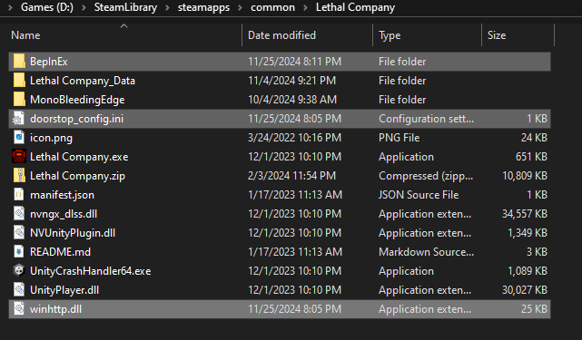

# GBB.LethalCompany.Modpack
This serves as a host for the Lethal Company modpack, this is required to be installed before joining the our hosted Lethal Company servers.

# Installation
1. Download the most recent zip file found in the releases section.
    * https://github.com/12emerta/GBB.LethalCompany.Modpack/releases
2. Extract the zip file and all its contents.
3. Place the extracted files into the base Lethal Company game directory
    * i.e. `C:\Program Files (x86)\Steam\steamapps\common\Lethal Company`
    * Your base game dir should now have a BepInEx folder located in it (i.e. `C:\Program Files (x86)\Steam\steamapps\common\Lethal Company\BepInEx`)
    * If you already have a BepInEx folder in the game directory it is best to fully delete it and replace it with this directory.
        * If you have custom configurations, do not delete the whole directory, it might be okay to just override all files (assuming you don't have extra mods and we haven't removed any).

# Mods
These are the following mods used within this mod pack:
* [More Company](https://thunderstore.io/c/lethal-company/p/notnotnotswipez/MoreCompany/)
    * Allows more than the default number of players to join. Plus adds fun cosmetics
